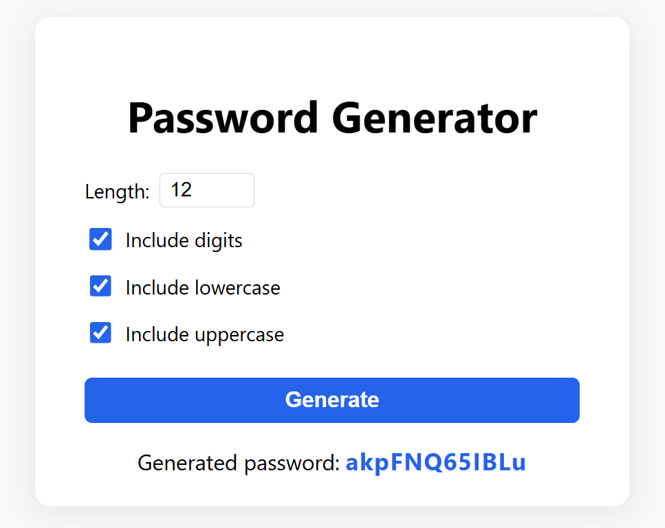

# Password Generator

A simple Go web application for generating passwords, options (length, digits, lowercase, uppercase).


## Running Locally

1. **Clone the repository:**
   ```sh
   git clone https://github.com/yourusername/passwordGenerator.git
   cd passwordGenerator
   ```

2. **Run with Go:**
   ```sh
   go run ./cmd/password-generator
   ```
   The app will be available at [http://localhost:8080](http://localhost:8080)

## Running with Docker

1. **Build and run with Docker Compose:**
   ```sh
   docker compose up --build
   ```
   The app will be available at [http://localhost:8080](http://localhost:8080)

2. **Or build and run manually:**
   ```sh
   docker build -t password-generator .
   docker run -p 8080:8080 password-generator
   ```